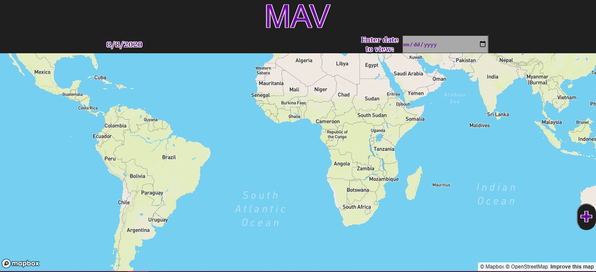
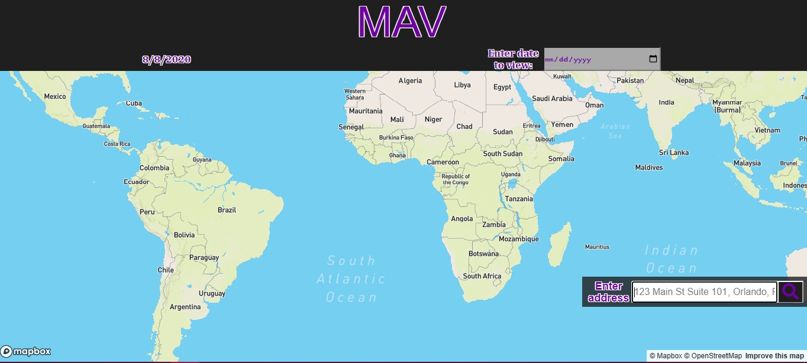
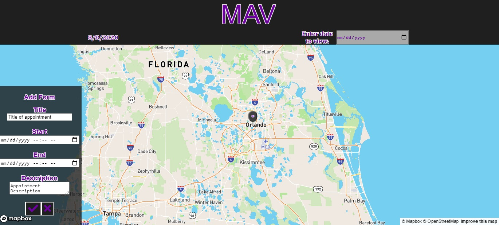
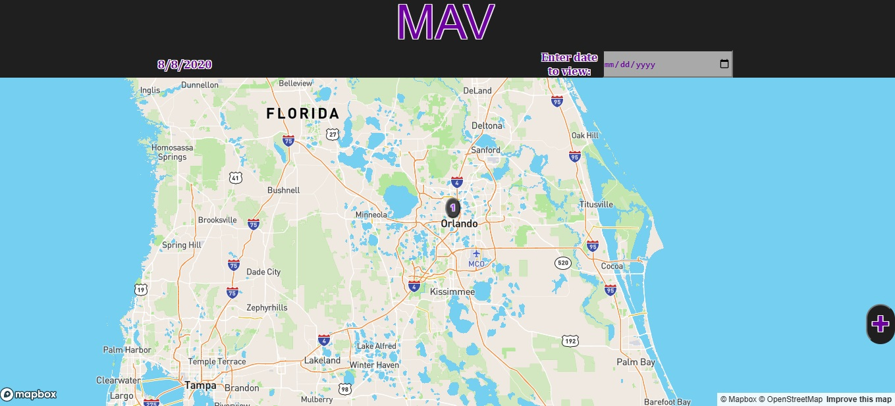
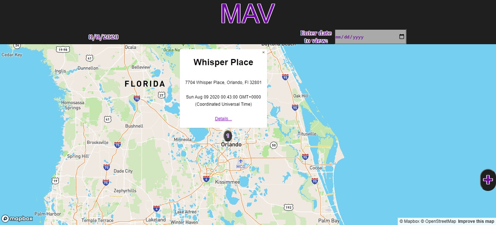
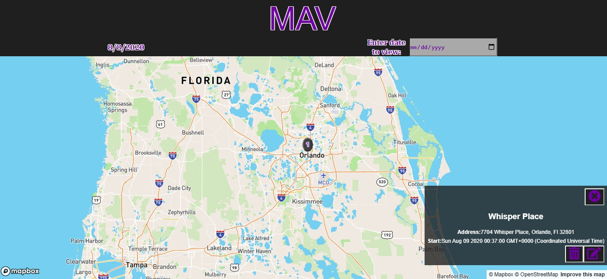

# MAV-Client
This project was bootstrapped with [Create React App](https://github.com/facebook/create-react-app).

To see the live app click [here](https://mav-client.vercel.app/).

To try MAV without creating an account use username 'demo' and password 'Password1!'

## API documentation

To view the repo for the API used in this app click [here](https://github.com/Tngtater9/mav-server).

The API has three endpoints Auth, Users, and Appointments.

## Summary

This app was created for a mobile auto glass repair service. With MAV the user is able to log in and view appointments for a given day. Numbered markers are used to show what order the appointments happen in. From the main view the user can click on the "+" to start adding an appointment. The first step lets the user search for the address and the second step lets the user fill in details. If the user wants to start over they can click on the new appointment marker, indicated by the "+", and the popup will like to the main screen. To view an existing appointment the user can click on a marker and the popup will show minimal details. To view the full details the user clicks on the "Details..." link in the popup. While viewing the details the user can delete or modify the appointment.

## Technology Used

MAV was created using ReactJS, JavaScript, Mapbox GL JS, and icons were provided by FontAwesome. The API was made with Express and Postgresql 12.

## Available Scripts

In the project directory, you can run:

### `npm start`

Runs the app in the development mode. 
Open [http://localhost:3000](http://localhost:3000) to view it in the browser.

The page will reload if you make edits. 
You will also see any lint errors in the console.

### `npm test`

Launches the test runner in the interactive watch mode. 
See the section about [running tests](https://facebook.github.io/create-react-app/docs/running-tests) for more information.

### `npm run build`

Builds the app for production to the `build` folder. 
It correctly bundles React in production mode and optimizes the build for the best performance.

The build is minified and the filenames include the hashes. 
Your app is ready to be deployed!

See the section about [deployment](https://facebook.github.io/create-react-app/docs/deployment) for more information.

### `npm run eject`

**Note: this is a one-way operation. Once you `eject`, you can’t go back!**

If you aren’t satisfied with the build tool and configuration choices, you can `eject` at any time. This command will remove the single build dependency from your project.

Instead, it will copy all the configuration files and the transitive dependencies (webpack, Babel, ESLint, etc) right into your project so you have full control over them. All of the commands except `eject` will still work, but they will point to the copied scripts so you can tweak them. At this point you’re on your own.

You don’t have to ever use `eject`. The curated feature set is suitable for small and middle deployments, and you shouldn’t feel obligated to use this feature. However we understand that this tool wouldn’t be useful if you couldn’t customize it when you are ready for it.

## Learn More

You can learn more in the [Create React App documentation](https://facebook.github.io/create-react-app/docs/getting-started).

To learn React, check out the [React documentation](https://reactjs.org/).

### Code Splitting

This section has moved here: https://facebook.github.io/create-react-app/docs/code-splitting

### Analyzing the Bundle Size

This section has moved here: https://facebook.github.io/create-react-app/docs/analyzing-the-bundle-size

### Making a Progressive Web App

This section has moved here: https://facebook.github.io/create-react-app/docs/making-a-progressive-web-app

### Advanced Configuration

This section has moved here: https://facebook.github.io/create-react-app/docs/advanced-configuration

### Deployment

This section has moved here: https://facebook.github.io/create-react-app/docs/deployment

### `npm run build` fails to minify

This section has moved here: https://facebook.github.io/create-react-app/docs/troubleshooting#npm-run-build-fails-to-minify
